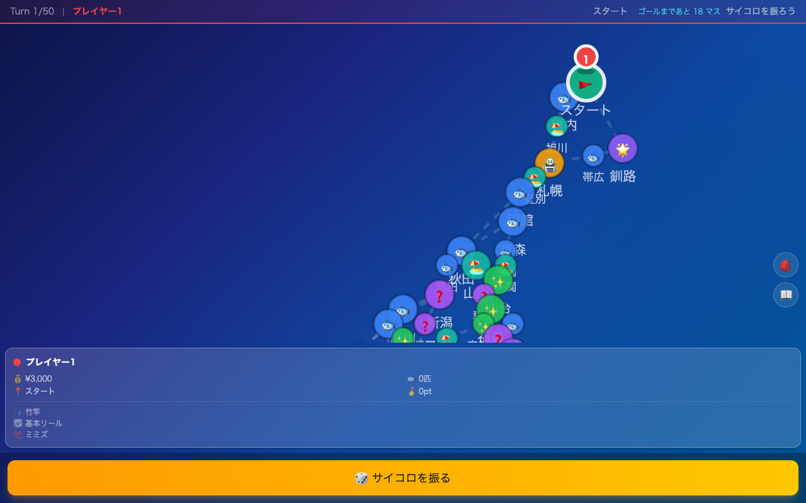

# 釣りすごろく - 日本列島 釣り旅

日本列島を舞台にしたすごろく型釣りボードゲーム。北海道から九州まで各地を巡り、魚を釣って高スコアを目指そう。

**[>>> プレイする (GitHub Pages) <<<](https://lutelute.github.io/Tsuri_sugoroku/)**


## 特徴

- 日本全国8地方を巡るマップ (北海道・東北・関東・中部・近畿・中国・四国・九州)
- 多彩な魚種 (common〜mythical の5段階レアリティ)
- タイミングベースの釣りミニゲーム (アタリ合わせ → リーリング)
- 装備のアップグレード (竿・リール・ルアー各Lv1〜5)
- イベントマス・ショップ・休憩所など多様なノード
- 1〜4人対戦
- 図鑑コンプリート要素

## スクリーンショット

| タイトル | セットアップ | ゲーム画面 |
|:---:|:---:|:---:|
|  |  |  |

## 技術スタック

- React 19 + TypeScript 5.9 + Vite 7
- Tailwind CSS v4
- Zustand (状態管理)
- Playwright (E2Eテスト)
- GitHub Actions → GitHub Pages 自動デプロイ

## ローカル開発

```bash
git clone https://github.com/lutelute/Tsuri_sugoroku.git
cd Tsuri_sugoroku
npm install
npm run dev
```
